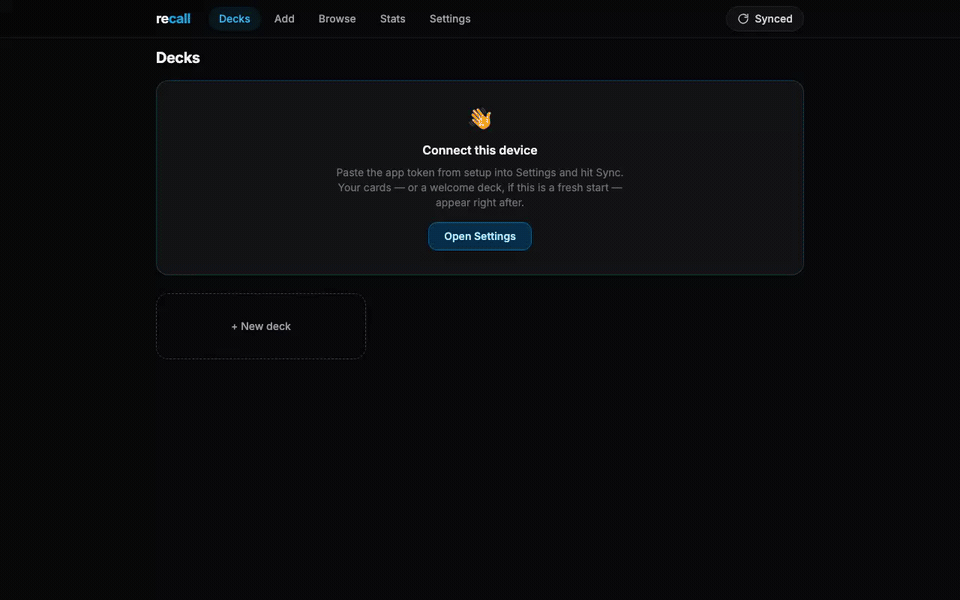

# recall

**Your flashcards as markdown, in your own git repo. Free forever.**

recall is a spaced-repetition app (think Anki) where every card is a plain
`.md` file in a GitHub repo **you** own, scheduling runs on
[FSRS](https://github.com/open-spaced-repetition/ts-fsrs), and the whole thing
deploys to Cloudflare's free tier in about five minutes. No accounts, no
servers to babysit, no subscription — **$0/month**, by design.



<sub>▶ [Full-quality video](docs/demo.mp4) · the tour adds a card, reviews with grading, searches, shows 90 days of stats, and switches accent/light-dark themes.</sub>

## Why

- **Own your data.** Cards are markdown files (`decks/<deck>/<id>.md`) in your
  repo — readable on GitHub, greppable, diffable, yours in 30 years.
- **Real spaced repetition.** FSRS scheduling with on-device parameter
  optimization from your own review history — the same algorithm modern Anki
  uses, not SM-2.
- **Writes like a text editor.** Markdown with code highlighting, KaTeX math,
  and paste-an-image support (auto-optimized to WebP). Front, `---`, back:

  ```markdown
  What does `Box<T>` do in Rust?
  ---
  Heap-allocates `T`.
  ```

- **Local-first PWA.** Everything is instant from IndexedDB and works fully
  offline — on the subway, on a plane. Reviews queue and sync when you're back.
- **Multi-device that converges.** The review log is the source of truth;
  the worker replays it deterministically, so offline reviews on two devices
  merge instead of conflicting.
- **No telemetry, no account, no middleman.** Your GitHub token never leaves
  your Cloudflare worker. One bearer token connects your devices.

## Setup (~5 minutes)

You need: a free [Cloudflare account](https://dash.cloudflare.com/sign-up), a
GitHub repo for your cards (private recommended, e.g. `yourname/recall-decks`),
and a [fine-grained PAT](https://github.com/settings/personal-access-tokens/new)
scoped to **only that repo** with **Contents: Read and write**.

**[Fork this repo first](https://github.com/samanamp/recall/fork)** (not "Use this
template" — a template is a clean copy with no link back here, so it can never
pull updates; a fork can). Then clone *your* fork and run the wizard:

```bash
git clone https://github.com/<you>/recall
cd recall
node tools/setup.mjs
```

The wizard logs into Cloudflare, creates the D1 database, writes the config,
sets your secrets, builds, and deploys. It prints your personal app URL —
open it on each device, paste your app token in **Settings**, and hit
**Sync now**. On a phone, "Add to Home Screen" installs it as an app. A
welcome deck walks you through the rest.

## Updating

Because you forked, new work here flows to you. Turn on hands-off auto-deploy once:

1. On your fork: **Actions** tab → enable workflows (forks start with Actions
   off — this also gates the weekly schedule).
2. **Settings → Secrets and variables → Actions** → add the Cloudflare
   credentials and your D1 id. The exact list is at the top of
   [.github/workflows/deploy.yml](.github/workflows/deploy.yml). Your
   `APP_TOKEN` / `GITHUB_TOKEN` are worker secrets set by `setup.mjs` and
   persist across deploys, so they're never stored in GitHub.

After that, the deploy workflow runs three ways:

- **Weekly schedule** — fast-forwards your fork from upstream and redeploys.
  Fully automatic; nothing to click. *(GitHub auto-pauses scheduled workflows
  on a fork after 60 days of no activity — you'll get an email, one click
  resumes.)*
- **Sync fork** — the button on your fork's homepage, whenever you want updates
  now instead of waiting for Monday.
- **Run workflow** — the manual button on the Actions → Deploy page.

Prefer to stay in control? Skip the Actions setup and update by hand with
`git pull upstream main && node tools/setup.mjs` (re-running is safe). Keep any
local customizations on a branch — the scheduled sync is fast-forward-only, so
it won't touch your fork if `main` has diverged (it deploys your code as-is).

## Free-tier limits, honestly

Everything runs inside Cloudflare's and GitHub's free tiers. For one person —
even a heavy, 200-reviews-a-day person — you will not get anywhere near the
limits (100k worker requests/day, 100k DB writes/day, 5M reads/day). The
sync is designed around them: steady state is a single ~100ms round trip.
Sharing one deployment with a handful of family members is fine; running a
public service off one free account is not what this is for.

## Architecture

```
app/     — React PWA (Vite + TS + Tailwind + Dexie + ts-fsrs)
worker/  — Cloudflare Worker: serves the app (static assets) + API at /api
           (Hono + D1 + GitHub proxy)
tools/   — setup wizard, maintenance scripts
```

- **Cards/media:** the app keeps a local copy in IndexedDB and pushes edits as
  git commits via the worker (your GitHub token never leaves Cloudflare).
  Pulls diff the repo tree against local blob SHAs.
- **Reviews:** each rating is scheduled locally with `ts-fsrs` immediately and
  queued; the worker stores the append-only log in D1 and derives canonical
  FSRS state by replaying each card's log, which devices adopt on next sync.
- Everything works offline; queues drain on reconnect.

See [SPEC.md](SPEC.md) for the original design document.

## Development

```bash
cd worker && cp wrangler.example.toml wrangler.toml  # fill in placeholders
cd worker && npx wrangler dev    # API + local D1 at localhost:8787
cd app && npm run dev            # app at localhost:5173, /api proxied to 8787
```

Tests: `npx vitest run` in `app/` (card format, scheduler, optimizer data
prep) and `worker/` (replay determinism/convergence). CI runs both plus
typechecks on every push.

## License

[MIT](LICENSE)
